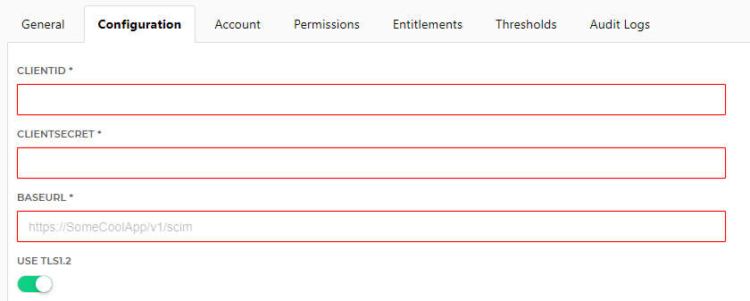

# HelloID-Conn-Prov-Target-Generic-Scim
[Work in progress]

  

## Table of contents

- [Introduction](#Introduction)
- [Getting started](#Getting-started)
  + [Connection settings](#Connection-settings)
  + [Prerequisites](#Prerequisites)
  + [Contents](#Contents)
  + [PowerShell functions](#PowerShell-functions)
  + [Supported PowerShell versions](#Supported-PowerShell-versions)
- [Setup the connector](#Setup-the-connector)
- [Getting help](#Getting-help)
- [Contributing](#Contributing)
- [HelloID Docs](#HelloID-Docs)

## Introduction

The _'HelloID-Conn-Prov-Target-Generic-Scim'_ connector is a working example target connector based on scim based API's. http://www.simplecloud.info.

## Getting started

This connector is a working example for a scim based API.

> Although this is a working example, changes might have to be made according to your own environment.

Before implementing the connector in HelloID, make sure to test the connector in VSCode.

### Connection settings

| Setting     | Description |
| ------------ | ----------- |
| ClientID          | The ClientID for the SCIM API                      |
| ClientSecret      | The ClientSecret for the SCIM API                  |
| Uri               | The Uri to the SCIM API. <http://some-api/v1/scim> |
|             |                                            |

### Prerequisites

- When using the HelloID On-Premises agent, Windows PowerShell 5.1 must be installed.

- When the connector needs to be modified, make sure to have installed VSCode/PowerShell extension.

### Contents

| Files       | Description                                |
| ----------- | ------------------------------------------ |
| config.json | The configuration settings for HelloID                      |
| create.ps1  | The connector _create_ file that will create an account in the target system |
|             |                                            |

### PowerShell functions

The _create_.ps1_ file contains a few functions. All of which contain basic comment based help.

The functions that are available in version _1.0.0.0_:

- Get-GenericScimOAuthToken
- Invoke-GenericScimRestMethod
- Resolve-HTTPError

### Supported PowerShell versions

The connector is created for both Windows PowerShell 5.1 and PowerShell Core 7.0.3. This means that the connector can be executed in both cloud and on-premises using the HelloID Agent.

> Older versions of Windows PowerShell are not supported.

## Setup the connector

1. Make sure you have access to the scim based API for your application.

2. Add a new 'Target System' to HelloID.

3. On the _Account_ tab, click __Custom connector configuration__ and import the code from the _configuration.json_ file.

4. Under __Account Create__ click __Configure__ and import the code from the _create.ps1_ file.

5. Go to the _Configuration_ tab and fill in the required fields.

| Parameter         | Description                                        |
| ----------------- | -------------------------------------------------- |
| ClientID          | The ClientID for the SCIM API                      |
| ClientSecret      | The ClientSecret for the SCIM API                  |
| Uri               | The Uri to the SCIM API. <http://some-api/v1/scim> |
| IsConnectionTls12 | Enables TLS 1.2 (Only necessary when using Windows PowerShell 5.1)        |
|             |                                            |

## Getting help

> _For more information on how to configure a HelloID PowerShell connector, please refer to our [documentation](https://docs.helloid.com/hc/en-us/articles/360012557600-Configure-a-custom-PowerShell-source-system) pages_

> _If you need help, feel free to ask questions on our [forum](https://forum.helloid.com)_

## Contributing

Find a bug or have an idea! Open an issue or submit a pull request!

## HelloID Docs

The official HelloID documentation can be found at: https://docs.helloid.com/
